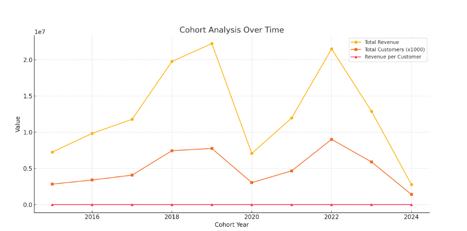
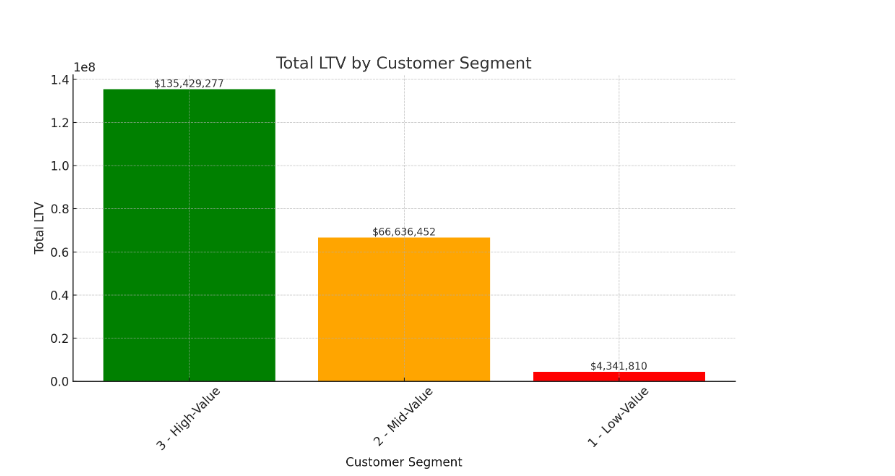
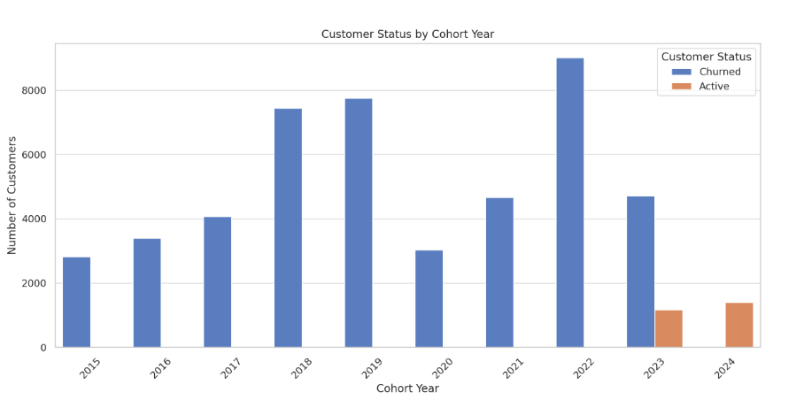

# Intermediate SQL Project

## Overview
Analysis of customer behavior, retention, and lifetime value for an e-commerce company to improve customer retention and maximize revenue.

## Business Questions
1. **Customer Segmentation:** Who are our most valuable customers?
2. **Cohort Analysis:** How do different customer groups generate long-term revenue?
3. **Retention Analysis:** Which customers haven't purchased recently?

## Analysis Approach

### 1. Customer Cohort Analysis
- Categorized customers based on total lifetime value (LTV)
- Assigned customers to High, Mid, and Low-value segments
- Calculated key metrics: total revenue

🖥️ Query: [cohort_analysis.sql](Scripts/1_cohort_analysis.sql)

**📈 Visualization:**

📊 **Key Findings:**
- Steady Revenue Growth (2015–2019): Total revenue grew significantly from 2015 to 2019, indicating a successful period of customer acquisition and/or increased spending per customer during these years.
- Decline in Revenue per Customer (Post-2019): While total revenue remained high until 2022, the average revenue per customer has been gradually decreasing since 2019, suggesting reduced individual customer value or changes in purchasing behavior.
- Recent Downturn (2023–2024): Both total revenue and revenue per customer dropped notably in 2023 and 2024, which could signal retention issues, a declining market, or reduced new customer acquisition effectiveness.

💡 **Business Insights**
- Customer Quality Over Quantity Matters
While total customer numbers grew over time, the revenue per customer declined post-2019. This suggests that newer customers may be less engaged, lower-spending, or not as well-targeted.

    → Focus on acquiring high-value customers or improving onboarding and retention strategies to increase customer lifetime value (CLV).
- Revenue Plateau Signals Saturation or Market Shift
The sharp drop in revenue in 2023–2024 may indicate market saturation, declining product relevance, or emerging competitors.

    → Review market conditions, refresh offerings, or consider new customer segments or geographies to maintain growth.
- Cohort Performance Benchmarking is Crucial
Older cohorts (2016–2019) are significantly outperforming recent ones in terms of revenue per customer.

    → Analyze what worked during those years (marketing channels, pricing, promotions) and replicate or adapt those strategies for current cohorts.

### 2. Customer Segmentation
- Categorized customers based on total lifetime value (ltv)
- Assigned customers to High, Mid, Low-value segments
- Calculated key metrics: total revenue

🖥️ Query: [customer_segmentation.sql](Scripts/2_customer_segmentation.sql)

**📈 Visualization:**

📊 **Key Findings:**
- **High-Value** segment (25% of customers) drives 66% of revenue ($135.4M)
- **Mid-Value** segment (50% of customers) generates 32% of revenue ($66.6M)
- **Low-Value** segment (25% of customers) accounts for 2% of revenue ($4.3M)

💡 **Business Recommendation**
- **High-Value** - VIP programs, loyalty rewards, exclusive offers, personal account managers
- **Mid-Value** - Targeted marketing, personalized offers, product bundling, referral incentivesaccount managers
- **Low-Value** - 	Automated email campaigns, education about value, or deprioritize for marketing

### 3. Retention Analysis
- Identified customers at risk of churning
- Analyzed last purchase patterns
- Calculated customer-specific metrics and warning indicators

🖥️ Query: [retention_analysis.sql](Scripts/3_retention_analysis.sql)

**📈 Visualization:**

📊 **Key Findings:**
- 100% Churn in Older Cohorts (2015–2022)
- 2023 Cohort Shows Partial Retention
    - Out of 5,890 customers acquired in 2023:
    - 1,172 (20%) are still active.
    - 4,718 (80%) have churned.
- 2024 Cohort Is Fully Active
    - All 1,402 customers acquired in 2024 are currently active.
    - This likely reflects recency bias—customers are too new to have churned yet.

💡 **Business Insights**
- Lack of Long-Term Retention
    - The fact that all cohorts before 2023 are fully churned suggests poor long-term customer retention strategies.
    - There may be issues in post-sale engagement, product lifecycle management, or customer support.
- Urgency to Improve Onboarding and Engagement
    - The 2023 cohort has already lost 80% of its customers, possibly within the first year.
    - This signals a need to improve customer onboarding, follow-ups, and value delivery in the early months.
- Opportunities to Build Loyalty in Newer Cohorts
    - Loyalty programs
    - Usage-based rewards
    - Feedback loops and satisfaction surveys

## Technical Details
- **Database:** PostgreSQL
- **Analysis Tools:** PostgreSQL, PgAdmin4, Dbeaver
- **Visualization:** ChatGPT1